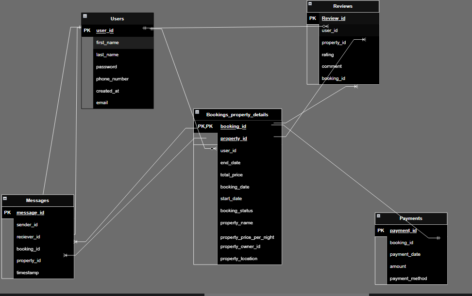

Entities  - Users , Properties, Bookings,Payments,Messages,Reviews
Relationships -Users can own many properties,
              -Users can book more than one bookings, 
              -Users can message more than once,A user could also comment more than once,
              -A bookings has one property,
              -One Booking has one payment
              -A property could have more than one review
              

